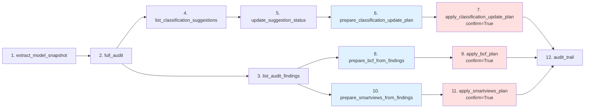

# Workflow AMO BIM — référence

Ce document décrit le **workflow cible** d'un AMO BIM I3F utilisant
`audit-bim-i3f` via Claude (ou tout autre client MCP). Chaque étape est
explicitement lecture seule ou écriture contrôlée, sans surprise.

Le workflow est conçu pour que **rien n'écrive dans BIMData** tant que
l'AMO n'a pas explicitement validé (`confirm=True`) un plan préparé et
scellé.

## Vue d'ensemble (12 étapes)

```
1.  extract_model_snapshot                                  [R] cache snapshot
2.  full_audit (ou run_audit_tool)                          [R] calcule findings
3.  list_audit_findings                                     [R] filtre findings
4.  list_classification_suggestions                         [R] lazy-populate store
5.  update_suggestion_status(uuid, "accepted")              [R] modifie session
6.  prepare_classification_update_plan                      [R+disque] scelle plan
7.  apply_classification_update_plan(confirm=True)          [W] pousse classifs
8.  prepare_bcf_from_findings                               [R+disque] scelle plan
9.  apply_bcf_plan(confirm=True)                            [W] pousse BCF
10. prepare_smartviews_from_findings                        [R+disque] scelle plan
11. apply_smartviews_plan(confirm=True)                     [W] pousse Smart Views
12. audit_trail                                             [R] revue journal
```

`[R]` = lecture seule · `[R+disque]` = écrit en sandbox `AUDIT_OUTPUT_DIR/`
seulement · `[W]` = écriture BIMData via API.

## Étapes détaillées

### 1. `extract_model_snapshot()` — Cache du snapshot

Récupère le modèle complet depuis BIMData (`/element/raw` + hiérarchie
spatiale + Psets). Cache local dans `.audit_cache/` validé par
`modified_date`. À appeler après `set_active_model(...)`.

```python
extract_model_snapshot(use_cache=True)
# → {"sites": 1, "buildings": 1, "storeys": 4, "spaces": 14, "elements": 1532}
```

### 2. `full_audit(...)` — Audit complet

Orchestrateur : parse les 3 documents MOA, extrait le snapshot (si pas
déjà fait), exécute les 6 règles, produit Word + XLSX. Avec
`push_mode="ask"` (défaut), ne pousse **rien** dans BIMData — c'est le
workflow AMO qui décide en étapes 7/9/11.

```python
full_audit(phase="PRO", push_mode="ask")
# → {"summary": {...}, "deliverables": {"word": "...", "xlsx": "...", ...}}
```

Variante minimale si on a déjà le contexte : `run_audit_tool()`.

### 3. `list_audit_findings(filter=...)` — Filtrer les findings

Filtrage déclaratif sans recalculer l'audit. Pagination automatique +
overflow disque à 256 KB.

```python
list_audit_findings(filter={"severity_min": "HIGH"})
# → {"items": [...], "total": 27, "next_offset": null}

list_audit_findings(filter={
    "themes": ["Classification IFC"],
    "error_types": ["classification_missing"],
    "ifc_types": ["IfcWall", "IfcWallStandardCase"],
    "limit": 100,
})
```

### 4. `list_classification_suggestions(filter=...)` — Voir les suggestions

Lazy-populate au premier appel : peuple le `ClassificationSuggestionStore`
depuis les findings `classification_missing` / `classification_invalid`.
Les statuts non-`proposed` (accepted / rejected / applied) sont préservés
entre appels.

```python
list_classification_suggestions(filter={"min_confidence": 0.85})
# → {
#     "items": [{
#         "element_uuid": "...",
#         "proposed_classification": "B2010",
#         "confidence": 0.92,
#         "confidence_band": "high",
#         "status": "proposed",
#     }, ...],
#     "total": 23,
#     "store_counts": {"by_status": {"proposed": 47}, "by_band": {...}, ...}
# }
```

### 5. `update_suggestion_status(...)` — Accepter / rejeter par UUID

Bascule le statut d'une suggestion. **Ne touche pas BIMData** — modifie
uniquement le store en session.

```python
update_suggestion_status(element_uuid="ABC", status="accepted")
update_suggestion_status(element_uuid="XYZ", status="rejected")
```

L'AMO peut basculer un grand nombre de suggestions en boucle. Convention
recommandée : accepter d'abord les `confidence_band="high"` (>= 0.85),
puis revoir les `medium` ([0.55, 0.85[).

### 6. `prepare_classification_update_plan(...)` — Scelle le plan

Calcule le `WritePlan` (kind=`classification_update`) à partir des
suggestions `accepted` du store, scelle SHA-256, écrit sous
`AUDIT_OUTPUT_DIR/plans/<plan_id>.json`. **Aucune écriture BIMData.**

```python
prepare_classification_update_plan()
# → {
#     "plan_id": "...",
#     "plan_path": "/.../plans/<uuid>.json",
#     "kind": "classification_update",
#     "target": {"cloud_id": "...", "project_id": "...", "model_id": "..."},
#     "summary": {
#         "n_classifications": 47,
#         "n_overwrite": 3,       # ← signalé en risks
#         "n_missing_current": 44,
#     },
#     "risks": ["3 éléments ont déjà une classification — écrasement..."],
#     "requires_confirm": true,
# }
```

L'AMO peut **revoir le plan** (chemin renvoyé) avant d'appliquer. Tant
qu'`apply_*` n'est pas appelé avec `confirm=True`, le plan reste un
fichier inerte.

Alias plus parlant : `prepare_classification_corrections()`.

### 7. `apply_classification_update_plan(plan_path, confirm=True)`

Recharge le plan, vérifie son intégrité (SHA-256), valide la cible
BIMData actuelle, puis exécute. Met à jour les statuts en `applied`
pour les UUIDs réellement liés.

```python
apply_classification_update_plan(
    plan_path="/.../plans/<uuid>.json",
    confirm=True,  # ← obligatoire
)
# → {
#     "plan_id": "...",
#     "kind": "classification_update",
#     "succeeded": 45,
#     "failed": 2,
#     "impacted_uuids": [...],   # uniquement les linked_uuids
#     "errors": [...],
# }
```

`confirm=False` → retour `{"refused": True, "reason": "..."}` sans toucher
BIMData.

Alias : `apply_classification_corrections()`.

### 8. `prepare_bcf_from_findings(...)` — Plan BCF Topics

Prépare la création de BCF Topics dans le panneau *BCF Issues* du
viewer. Groupé par thème d'anomalie + un topic « Vue d'ensemble ».

```python
prepare_bcf_from_findings(
    finding_filter={"severity_min": "HIGH"},  # optionnel
    prefix="I3F Audit — ",
    include_overview=True,
)
# → {"plan_id": "...", "plan_path": "...", "summary": {"n_topics": 6, ...}}
```

Sous-jacent : `prepare_bcf_topics(...)` (alias direct).

### 9. `apply_bcf_plan(plan_path, confirm=True)`

Exécute le plan BCF. Idem 7 côté garanties (intégrité, cible, confirm).

```python
apply_bcf_plan(plan_path="...", confirm=True)
# → ActionResult{succeeded, failed, impacted_uuids, errors}
```

Sous-jacent : `apply_bcf_topics(...)`.

### 10. `prepare_smartviews_from_findings(...)` — Plan Smart Views

Prépare des Smart Views (panneau dédié du viewer, navigation 3D minimale,
pas de workflow d'issue). Coloring par sévérité maximale rencontrée.

```python
prepare_smartviews_from_findings()
# → {"plan_id": "...", "plan_path": "...", "summary": {"n_smart_views": 6, ...}}
```

### 11. `apply_smartviews_plan(plan_path, confirm=True)`

Exécute le plan Smart Views.

```python
apply_smartviews_plan(plan_path="...", confirm=True)
```

### Interroger la maquette — requêtes sémantiques

Au-delà du workflow d'audit, le MCP expose un moteur de requête
**tabulaire sémantique** sur les objets de la maquette. Idéal pour
qu'un agent IA réponde à des questions type :

> *« Liste tous les matériaux des portes, leur performance acoustique
> et leurs dimensions. »*

Trois tools :

- `query_bim_data(filter, fields, ...)` — requête générique.
- `query_bim_preset(preset, ...)` — variante préconfigurée.
- `list_query_presets()` — liste des presets disponibles.

#### Exemples

**Portes : matériaux, acoustique, dimensions, feu, localisation**

```python
query_bim_preset(preset="doors_acoustic_dimensions", limit=200)
# Équivalent générique :
query_bim_data(
    filter={"ifc_types": ["IfcDoor", "IfcDoorStandardCase"]},
    fields=[
        "name", "object_type", "materials",
        "acoustic_performance", "height", "width", "thickness",
        "fire_rating", "storey", "space",
    ],
)
```

**Murs : matériaux, feu, acoustique, épaisseur, externe/porteur**

```python
query_bim_preset(preset="walls_fire_acoustic")
```

**Équipements : fabricant, référence, maintenance ID, série, tag**

```python
query_bim_preset(preset="equipment_maintenance")
```

**Requête ad-hoc sur n'importe quel Pset projet**

```python
query_bim_data(
    filter={"ifc_types": ["IfcSpace"]},
    fields=["name", "storey", "Pset_3F.Lot", "Pset_3F.UsageRevit"],
    include_empty=False,
)
```

#### Champs supportés

Identité : `uuid`, `ifc_type`, `name`, `long_name`, `object_type`,
`predefined_type`, `description`.

Spatial : `storey`, `space`, `zone`.

Classifications : `classification`, `classification_level_3`,
`classifications`.

Listes : `materials`, `layers`.

Booléens : `is_external`, `load_bearing`.

Dimensions : `dimensions` (dict), `height`, `width`, `thickness`,
`area`, `volume`, `perimeter`, `length`. Lus depuis `BaseQuantities`
en priorité, puis Psets en fallback.

Sémantique métier : `acoustic_performance`, `fire_rating`,
`manufacturer`, `reference`, `tag`, `maintenance_id`, `serial_number`.

**Tout nom de Pset projet est accepté** en fallback dynamique
(ex: `Pset_3F.Lot`).

#### Garanties

- **Aucun appel API BIMData** si le snapshot est déjà chargé.
- **Pagination** : `limit` ≤ 500, `offset` libre.
- **Overflow disque** automatique au-delà de 256 KB (le retour MCP
  reste < 1 MB).
- **Source par cellule** : chaque valeur retournée porte sa source
  (`property` / `quantity` / `attribute` / `material` / `missing`)
  pour la traçabilité. Activer via `include_cells=True`.
- **Warnings explicites** : champs inconnus, ou champs vides sur > 80 %
  des lignes (utile pour diagnostiquer une maquette mal renseignée).

### DOE workflow (variante en phase DOE/GESTION)

Quand l'AMO dispose d'un dossier DOE (Excel ou PDF) à intégrer dans la
maquette, le workflow d'enrichissement suit le même pattern
prepare/apply :

```
DOE-1. extract_doe_records                                  [R] parse Excel/PDF
DOE-2. match_doe_to_ifc                                     [R] rapproche aux éléments IFC
DOE-3. prepare_doe_enrichment_plan                          [R+disque] pré-calcule les conflits
DOE-4. apply_doe_enrichment_plan(confirm=True)              [W] pousse les Psets
```

Le pré-calcul des conflits classifie chaque propriété DOE comme
``MATCH`` (valeur déjà présente, skip), ``NEW`` (absente, à écrire),
``UPGRADE`` (présente mais vide, à écrire) ou ``CONFLICT`` (différente
— traitement selon ``on_conflict``).

```python
prepare_doe_enrichment_plan(
    doe_path="DOE_lot_CVC.xlsx",
    on_conflict="report",  # n'écrase pas (recommandé)
)
# → summary.conflicts_summary = {n_total, by_type: {match, new, upgrade, conflict}}
# → risks signale les conflits CONFLICT et le mode 'overwrite' éventuel
```

Alias métier : `prepare_doe_enrichment_from_file` / `apply_doe_enrichment`.

### 12. `audit_trail(limit=20)` — Revue post-exécution

Liste les `apply_*` exécutés sur cette session (journal append-only
sous `AUDIT_OUTPUT_DIR/write_log/journal.jsonl`).

```python
audit_trail(limit=10)
# → {
#     "entries": [{
#         "timestamp": "2026-05-26T15:10:10+00:00",
#         "action": "apply_classification_update",
#         "plan_id": "...",
#         "target": {...},
#         "succeeded": 45,
#         "failed": 2,
#         "impacted_uuids_count": 45,
#     }, ...],
#     "total_returned": 10,
# }
```

## Garanties transverses

| Garantie | Implémentation |
|---|---|
| Aucune écriture sans confirm explicite | tous les `apply_*` retournent `{"refused": True}` sans `confirm=True` |
| Plan altéré rejeté | SHA-256 scellé hors champs volatiles (`plan_id`, `created_at`) |
| Cible changée entre prepare et apply rejetée | `validate_target` compare cloud/project/model |
| Tools MCP < 1 MB | `maybe_dump_to_disk` (overflow > 256 KB) |
| Sandbox stricte | `safe_export_path` / `safe_export_read_path` |
| Erreurs scrubées | `redact_secrets` (Bearer, access_token, Authorization, …) |
| Journal append-only | `WriteJournal` JSONL thread-safe |
| Statuts précis sur partial failure | seuls les UUIDs `linked_uuids` passent en `applied` |

## Schéma Mermaid



Bleu = `prepare_*` (lecture seule, scelle un plan). Rouge = `apply_*`
(écriture BIMData, exige `confirm=True`).

## Tools à éviter

Les tools listés ci-dessous sont **dépréciés** (`removal_version=0.3.0`).
Ne plus les utiliser dans le workflow cible :

| Tool déprécié | Remplaçant actif |
|---|---|
| `suggest_classifications` | `list_classification_suggestions` (étape 4) |
| `create_bcf_topics` | `prepare_bcf_topics` / `apply_bcf_topics` (étapes 8-9) |
| `create_smart_views` | `prepare_smart_views_plan` / `apply_smart_views_plan` (étapes 10-11) |
| `apply_suggested_classifications` | workflow complet 4 → 7 |

Cf. [docs/migration_prepare_apply.md](migration_prepare_apply.md) pour les
exemples de migration.

## Politique de non-investissement

`suggest_classifications` est conservé en lecture seule pour
compatibilité — aucun nouveau développement n'est prévu dessus. **En cas
de bug critique sur ce tool**, l'AMO doit migrer vers
`list_classification_suggestions`. La suppression définitive est planifiée
pour la **v0.3.0**.

## Voir aussi

- [docs/mcp_tools.md](mcp_tools.md) — référence des 40 tools (statut, R/W, confirm requis)
- [docs/migration_prepare_apply.md](migration_prepare_apply.md) — guide migration
- [audit_bim/mcp/deprecation.py](../audit_bim/mcp/deprecation.py) — registre central
